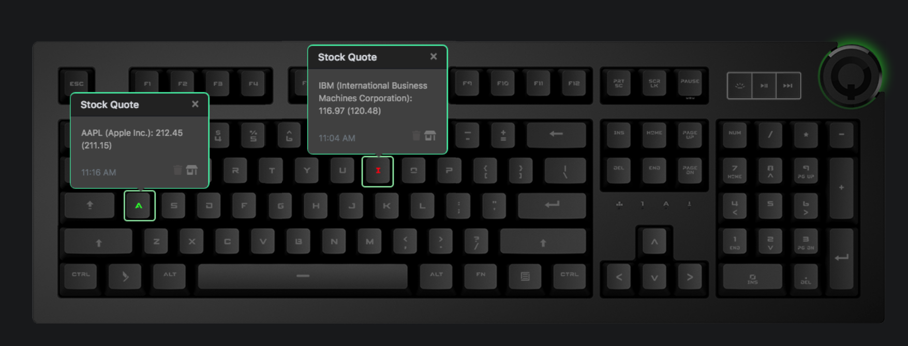

# Q Applet: Stock Quote

Displays stock quote variations on a Das Keyboard Q Series.

[GitHub repository](https://github.com/daskeyboard/q-applet-stock-quote)

## Example

Displays stock quote changes on a Das Keyboard Q Series.
Keys are assigned either a green or a red color depending on the stock 
trading higher or lower than the previous day's close

## Changelog

[CHANGELOG.MD](CHANGELOG.md)

## Installation

Requires a Das Keyboard Q Series: www.daskeyboard.com/5q

Installation, configuration and uninstallation of applets is done within
the Q Desktop application (https://www.daskeyboard.io/get-started/software/)

## Docs & Contribute

## Copyright / License

Copyright 2014 - 2018 Das Keyboard / Metadot Corp.

Licensed under the GNU General Public License Version 2.0 (or later);
you may not use this work except in compliance with the License.
You may obtain a copy of the License in the LICENSE file, or at:

   http://www.gnu.org/licenses/old-licenses/gpl-2.0.txt

Unless required by applicable law or agreed to in writing, software
distributed under the License is distributed on an "AS IS" BASIS,
WITHOUT WARRANTIES OR CONDITIONS OF ANY KIND, either express or implied.
See the License for the specific language governing permissions and
limitations under the License.
